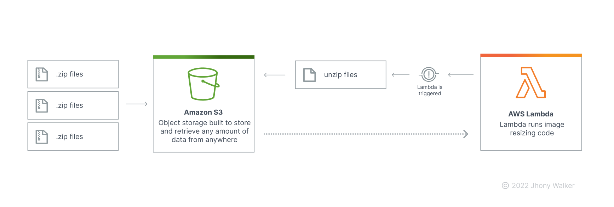
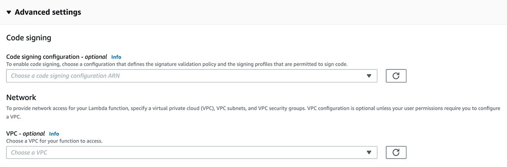
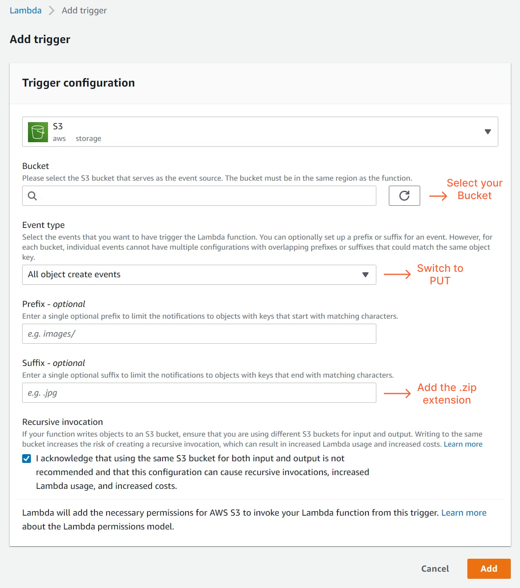

Sabemos que em algum momento surgirá a necessidade de fazer upload de vários arquivos do lado do cliente por meio de sua aplicação. Em uma rápida pesquisa encontramos perguntas semelhante no StackOverflow de como realizar esse processo porém, por se tratar de AWS as respostas mais aceitas é atraves de uma implementação utilizando a AWS CLI, quando é encontrado algum processo realizado utilizando Javascript é usando o `promise.all` mas certamente não é uma opção do lado do cliente. Também encontraremos algumas implementações usando Python e boto3, mas para um aplicativo que foi escrito em Node.js como fazemos? Certamente existe uma abordagem melhor e mais rápida do que transformar esse script Node.js em Python....

Após algumas pesquisas mais afundo, descobri que a estrutura do arquivo zip tem seu diretório central localizado no final do arquivo e existem cabeçalhos locais que são uma cópia do diretório central, mas não são confiáveis. E os métodos de leitura da maioria das outras bibliotecas de streaming armazenam em buffer todo o arquivo zip na memória, anulando todo o propósito de transmiti-lo em primeiro lugar. Então, aqui está um algoritmo criado usando a biblioteca yauzl (biblioteca de descompactação para Node.js)

### Conteúdo

- [Conteúdo](#content)
- [Processo e Fluxograma](#process)
- [Requisitos para implementação](#requirements)
- [O que usaremos](#what-we-will-use)

## Processo

- [ ] O usuário carrega muitos arquivos por meio da aplicação.
- [ ] A aplicativo compacta esses arquivos usando a biblioteca [yazl](https://www.npmjs.com/package/yauzl) e os carrega em um balde S3 no lado do cliente.
- [ ] Um evento `PUT` do AWS S3 aciona a função Lambda.
- [ ] A função Lambda extrai todo o objeto (arquivo .zip) para seu buffer de memória.
- [ ] Ela lê uma entrada e a carrega de volta para o S3.
- [ ] Quando o upload termina, ele segue para a próxima entrada e repete o processo.

<h1 align="center">
    
</h1>

**⚠️ Este algoritmo NÃO atinge o limite de RAM da função Lambda. Durante os testes o uso máximo de memória foi inferior a 500 MB para extrair um arquivo zip de 254 MB contendo 2,24 GB de arquivos.**

## Requistos para implementação

Antes de criar a sua função Lambda, é **necessário criar uma função IAM para a função Lambda que concede acesso ao Bucket S3**. Para isso, siga os passos abaixo:

1. Siga as etapas em [Criando uma função de execução no console do IAM](https://docs.aws.amazon.com/lambda/latest/dg/lambda-intro-execution-role.html#permissions-executionrole-console)
2. Na lista de funções do IAM, escolha a função que você acabou de criar.
3. Na guia **Permissões** , escolha **Adicionar política em linha**
4. Escolha a guia **JSON**
5. Insira uma política IAM baseada em recursos que conceda acesso ao seu bucket S3. Para obter mais informações, consulte [Usar políticas baseadas em recursos para AWS Lambda](https://docs.aws.amazon.com/lambda/latest/dg/access-control-resource-based.html)

Exemplo de política IAM que concede acesso a um bucket S3 específico:

**⚠️ Substitua "arn:aws:s3:::AWSDOC-EXAMPLE-BUCKET/\*" pelo nome de recurso da Amazon (ARN) do seu Bucket S3.**

```json
{
  "Version": "2022-12-22",
  "Statement": [
    {
      "Sid": "ExampleStmt",
      "Action": ["s3:PutObject", "s3:GetObject"],
      "Effect": "Allow",
      "Resource": ["arn:aws:s3:::AWSDOC-EXAMPLE-BUCKET/*"]
    }
  ]
}
```

Pronto, agora inicie o processo de criação da função Lambda pelo console da AWS, pesquisando por `lambda` e siga os passos abaixo:

1. Pressione o botão **Criar função** (ou Create function)
2. A próxima tela mostra diversas opções para o código da função. Familiarize-se com todas essas opções para trabalhar com as funções do Lambda:

- **Autor do zero (Author from scratch)** - Crie seu próprio código a partir de um exemplo Hello World.
- **Use um projeto (Use a blueprint)** - Os esquemas de código da AWS incluem integrações integradas da AWS com outros serviços e usos comuns. Esses esquemas podem economizar uma quantidade significativa de tempo ao desenvolver funções do Lambda.
- **Imagem do contêiner (Container image)** - As imagens de contêiner armazenadas no Amazon Elastic Container Registry também são úteis para iniciar novas funções do Lambda.
- **Navegue pelo repositório de aplicativos sem servidor (Browse serveless app repository)** No AWS Serverless Application Repository, os usuários podem encontrar vários produtos úteis.

Os campos de configuração básica incluem nome da função, tempo de execução e permissões. Os tempos de execução suportados incluem linguagens de programação como Node.js, Go, Python, Ruby, Java, C# e .NET. O Lambda também oferece suporte a tempos de execução personalizados, que um desenvolvedor pode implementar em qualquer linguagem que possa ser compilada no Amazon Linux OS. Esteja ciente de que a AWS adiciona novos tempos de execução e versões a [essa lista](https://docs.aws.amazon.com/lambda/latest/dg/lambda-runtimes.html) continuamente.

<h1 align="center">
    
</h1>

A seção **Configurações avançadas** exibe configurações como assinatura de código e VPC. A assinatura de código adiciona uma camada extra de segurança ao código Lambda. Isso garante que esse código não tenha sido alterado desde um determinado ponto no tempo. Um exemplo são as instâncias do Amazon Relational Database Service com acesso público desabilitado.

As configurações de VPC permitem que desenvolvedores sem servidor implantem funções do Lambda em uma VPC com acesso a recursos privados. Outro exemplo são os clusters do Amazon ElastiCache acessíveis apenas por meio de tabelas VPC e DynamoDB com VPC endpoints ativados.

<h1 align="center">
    
</h1>

Configure a função do Lambda para que ela seja acionada sempre que um arquivo .zip for carregado no bucket do S3. Para isso:

1. Clique no botão **Adicionar acionador** na seção **Visão geral** da função e selecione um evento S3 no menu suspenso.
2. Em seguida, escolha seu balde e selecione 'PUT' como o tipo de evento e também não se esqueça de adicionar '.zip' no campo de sufixo ou ele invocará automaticamente a função em um loop.
3. Em seguida, clique em **Adicionar** para adicionar o gatilho na função lambda.

<h1 align="center">
    
</h1>

## O que usaremos

Usaremos o [AWS SDK](https://www.npmjs.com/package/aws-sdk) para obter o arquivo do bucket S3. Dentro do objeto `event` da função `handler`, temos o array `Records` que contém o nome do Bucket S3 e a chave do objeto que acionou esta função lambda. Usaremos o array `Records` para obter o Bucket e a chave para o método `S3.getObject(params, [callback])` para buscar o arquivo zip.

## Licença

A licença MIT, também chamada de licença X ou licença X11, é uma licença de programa de computador criada pelo Massachusetts Institute of Technology. É uma licença permissiva usada tanto em software livre quanto em software proprietário.
