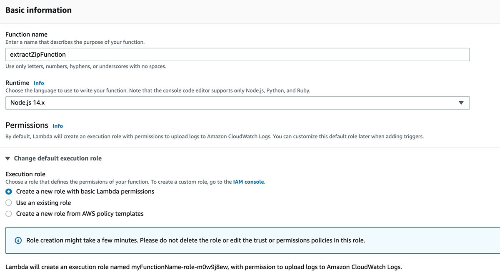

We know that at some point there will be a need to upload multiple client-side files through your application. In a quick search we found similar questions on StackOverflow on how to carry out this process, however, because it is AWS the most accepted answers are through an implementation using the AWS CLI, when a process is found using Javascript it is using `promise.all ` but it's certainly not a client-side option. We will also find some implementations using Python and boto3, but for an application that was written in Node.js how do we do it? Surely there is a better and faster approach than turning this Node.js script into Python....

After some more research I found that the zip file structure has its core directory located at the end of the file and there are local headers which are a copy of the core directory but are not reliable. And the read methods of most other streaming libraries buffer the entire zip file in memory, defeating the whole purpose of streaming it in the first place. So here is an algorithm created using yauzl library (unzip library for Node.js)

### Conteúdo

- [Contents](#content)
- [Process and Flowchart](#process)
- [Requirements for implementation](#requirements)

## Process

- [ ] The user uploads many files through the application.
- [ ] The application compresses these files using the [yazl](https://www.npmjs.com/package/yauzl) library and loads them into an S3 Bucket on the client side.
- [ ] A `PUT` event from AWS S3 triggers the Lambda function.
- [ ] The Lambda function extracts the entire object (.zip file) into its memory buffer.
- [ ] It reads an entry and loads it back to S3.
- [ ] When the upload is complete, it moves on to the next entry and repeats the process.

<h1 align="center">
    
</h1>

**⚠️ This algorithm does NOT hit the Lambda function RAM limit. During testing the maximum memory usage was less than 500MB to extract a 254MB zip file containing 2.24GB of files.**

## Requirements for implementation

Before creating your Lambda function, you **need to create an IAM role for the Lambda function that grants access to Bucket S3**. To do this, follow the steps below:

1. Follow the steps in [Creating an Execution Role in the IAM Console](https://docs.aws.amazon.com/lambda/latest/dg/lambda-intro-execution-role.html#permissions-executionrole-console)
2. From the list of IAM roles, choose the role you just created.
3. On the **Permissions** tab, choose **Add Inline Policy**
4. Choose the **JSON** tab
5. Enter a resource-based IAM policy that grants access to your S3 bucket. For more information, see [Using Resource-Based Policies for AWS Lambda](https://docs.aws.amazon.com/lambda/latest/dg/access-control-resource-based.html)

Example IAM policy granting access to a specific S3 bucket:

**⚠️ Replace "arn:aws:s3:::AWSDOC-EXAMPLE-BUCKET/\*" with the Amazon Resource Name (ARN) of your S3 Bucket.**

```json
{
  "Version": "2022-12-22",
  "Statement": [
    {
      "Sid": "ExampleStmt",
      "Action": ["s3:PutObject", "s3:GetObject"],
      "Effect": "Allow",
      "Resource": ["arn:aws:s3:::AWSDOC-EXAMPLE-BUCKET/*"]
    }
  ]
}
```

That's it, now start the process of creating the Lambda function through the AWS console, searching for `lambda` and follow the steps below:

1. Press the button **Create function**
2. The next screen shows several options for the function code. Familiarize yourself with all these options for working with Lambda functions:

- **Author from scratch** - Create your own code from a Hello World example.
- **Use a blueprint** - AWS' code blueprints include built-in AWS integrations with other services and common uses. These blueprints can save a significant amount of time when developing Lambda functions.
- **Container image** - Container images stored in Amazon Elastic Container Registry are also useful to launch new Lambda functions.
- **Browse serveless app repository** In AWS Serverless Application Repository, users can find various helpful products.

Basic configuration fields include role name, runtime, and permissions. Supported runtimes include programming languages such as Node.js, Go, Python, Ruby, Java, C# and .NET. Lambda also supports custom runtimes, which a developer can implement in any language that can be compiled on Amazon Linux OS. Please be aware that AWS adds new runtimes and versions to [this list](https://docs.aws.amazon.com/lambda/latest/dg/lambda-runtimes.html) on an ongoing basis

<h1 align="center">
    
</h1>

The **Advanced Settings** section displays settings such as Code Signing and VPC. Code signing adds an extra layer of security to Lambda code. This ensures that this code hasn't changed since a certain point in time. An example is Amazon Relational Database Service instances with public access disabled.

VPC configurations allow serverless developers to deploy Lambda functions in a VPC with access to private resources. Another example is Amazon ElastiCache clusters accessible only through VPC and DynamoDB tables with VPC endpoints enabled.

<h1 align="center">
    
</h1>

Configure the Lambda function such that it'll be triggered whenever a zip file is uploaded to the S3 bucket.

1. Click on the **Add trigger** button on the Function overview section and select an S3 event from the dropdown.
2. Then choose your bucket and select 'PUT' as the event type and also don't forget to add '.zip' in the suffix field or it'll self invoke the function in a loop.
3. Then click on **Add** to add the trigger on the lambda function.
